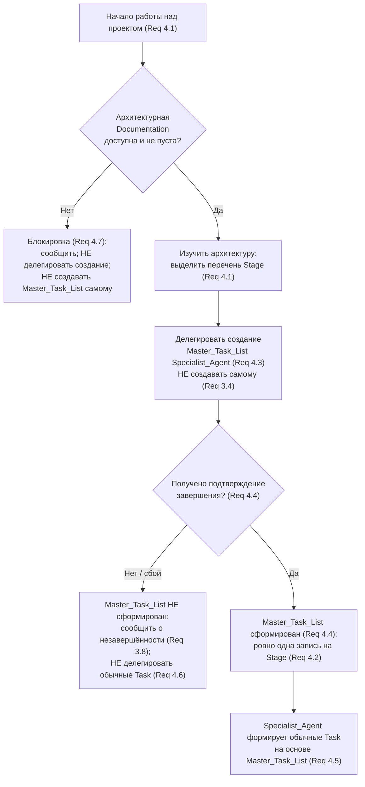

# Flow Orchestrator: планирование в первую очередь и Master_Task_List

> Правила режима **Flow Orchestrator**, кодирующие поведение «планирование в
> первую очередь»: изучение архитектуры проекта прежде любой работы и
> делегирование формирования Master_Task_List профильному Specialist_Agent.
>
> _Validates: Requirements 4.1, 4.3, 4.4, 4.5, 4.6, 4.7_

---

## Назначение

Этот файл описывает первый этап работы режима **Flow Orchestrator** —
**планирование**. До того как появятся обычные задачи (Task), Flow Orchestrator
обязан изучить документацию архитектуры проекта и поручить формирование
мастер-списка задач (Master_Task_List) профильному агенту-специалисту.

Главный принцип: **сначала план, потом задачи.** Flow Orchestrator не порождает
обычные Task и не пишет их содержимое до тех пор, пока Master_Task_List не
сформирован по подтверждению Specialist_Agent. И сам Master_Task_List Flow
Orchestrator не создаёт — он только делегирует его создание (см.
`00-core-identity.md`, Requirement 3).

> Замечание об именах: значения вида `<New_Project_Name>` / `<new-slug>` —
> заполнители, разрешаемые при установке шаблона в конкретный проект.

---

## Глоссарий (краткий)

- **Flow Orchestrator** — режим/агент-координатор; единственная задача —
  делегирование. Не создаёт файлы, задачи, директории и не пишет содержимое
  задач самостоятельно.
- **Specialist_Agent** — профильный агент-исполнитель с ровно одной
  специализацией (меткой технической области, например JavaScript, Rust).
- **Stage** — отдельный этап работы, описанный в документации архитектуры.
- **Documentation** — документы проекта (например, файлы в `docs/`, README,
  правила проекта), которые нужно прочитать и/или обновить.
- **Master_Task_List** — мастер-список задач верхнего уровня, формируемый на
  этапе планирования; ровно одна запись на каждый Stage.
- **Task** — обычная (регулярная) задача, формируемая Specialist_Agent на основе
  Master_Task_List.

---

## 1. Сначала изучить архитектуру (Requirement 4.1)

**WHEN** начинается работа над проектом, **THE** Flow Orchestrator **SHALL**
сначала изучить Documentation, описывающую архитектуру проекта, **прежде чем**
делегировать создание Master_Task_List или формирование обычных Task.

### Что значит «изучить архитектуру»

- Прочитать всю доступную Documentation, описывающую архитектуру проекта
  (например, файлы в `docs/`, обзор архитектуры, описание этапов/Stage).
- Выделить полный перечень **Stage** — этапов работы, описанных в этой
  Documentation. Перечень Stage становится основой биекции в Master_Task_List
  (см. раздел 3, Req 4.2).
- Для каждого Stage наметить, какая Documentation потребуется и какая область
  специализации к нему относится (для последующего назначения Specialist_Agent).

### Порядок строгий

```
1. Изучить архитектурную Documentation  (Req 4.1)
2. Делегировать создание Master_Task_List (Req 4.3)
3. (после формирования) Делегировать формирование обычных Task (Req 4.5)
```

Шаг 2 не начинается, пока не выполнен шаг 1. Шаг 3 не начинается, пока
Master_Task_List не сформирован (Req 4.6).

---

## 2. Делегировать создание Master_Task_List (Requirement 4.3)

**WHEN** Flow Orchestrator завершает изучение архитектурной Documentation,
**THE** Flow Orchestrator **SHALL** делегировать создание Master_Task_List
профильному Specialist_Agent и **SHALL NOT** создавать Master_Task_List
самостоятельно.

### Правила

- ✅ Flow Orchestrator **поручает** создание Master_Task_List Specialist_Agent.
- ❌ Flow Orchestrator **никогда** не создаёт Master_Task_List своими руками, не
  пишет его содержимое и не дополняет его (Req 3.4).
- Поручение адресуется агенту, чья специализация соответствует области планирования
  проекта; если подходящего агента нет — это блокирующая ситуация (см.
  `02-specialists-and-routing.md`, Req 5.6).

### Шаблон поручения

```
Кому: <Specialist_Agent для планирования>

Прочитай архитектурную Documentation: <идентифицируемые ссылки на документы>.
Создай Master_Task_List: ровно одну запись верхнего уровня для каждого Stage,
описанного в архитектурной Documentation. НЕ делегируй — только создай его.

Требования к каждой записи (Requirement 6):
- укажи >= 1 идентифицируемую ссылку на Documentation, необходимую для задачи;
- укажи ровно одного Specialist_Agent, ответственного за создание/выполнение.

По завершении пришли подтверждение, явно указывающее, что Master_Task_List
создан и содержит ровно одну запись на каждый Stage.
```

---

## 3. Состав Master_Task_List (Requirement 4.2, Requirement 6)

**THE** Master_Task_List **SHALL** содержать **ровно одну** запись верхнего
уровня для **каждого** Stage, описанного в архитектурной Documentation
(биекция Stage ↔ запись: нет пропущенных Stage и нет дублирующих записей для
одного Stage). _(Req 4.2)_

Каждая запись верхнего уровня **SHALL** указывать (Requirement 6):

- **≥ 1 идентифицируемую ссылку на Documentation**, необходимую для выполнения
  задачи этого Stage;
- **ровно одного** Specialist_Agent, ответственного за создание и/или выполнение
  задачи этого Stage.

Структурная проверка полноты записей выполняется командой `validate-master-list`
(перечисляет записи без Documentation или без ровно одного агента; биекция
Stage ↔ запись отражается признаком `stageBijectionHolds`).

| Атрибут записи | Требование | Проверка |
|----------------|-----------|----------|
| `stage` | соответствует Stage из архитектурной Documentation | биекция (Req 4.2) |
| `documentation` | ≥ 1 идентифицируемая ссылка | Req 6.1, 6.3, 6.4 |
| `specialistAgent` | ровно один, непустой | Req 6.2, 6.3, 6.5 |

---

## 4. Master_Task_List считается сформированным (Requirement 4.4)

**WHEN** Specialist_Agent подтверждает завершение создания Master_Task_List,
**THE** Flow Orchestrator **SHALL** считать Master_Task_List **сформированным**.

### Правила

- Master_Task_List считается сформированным **только** по явному подтверждению
  завершения от Specialist_Agent — не по факту отправки поручения и не по
  предположению Flow Orchestrator.
- До получения подтверждения Master_Task_List считается **не сформированным**, и
  действуют ограничения раздела 5 (Req 4.6).
- Если вместо подтверждения приходит сообщение о сбое или результат не
  соответствует требованиям (нет записей, пустое содержимое) — Master_Task_List
  не считается сформированным; Flow Orchestrator сообщает о незавершённости и не
  создаёт/не дополняет список сам (см. `00-core-identity.md`, Req 3.8).

---

## 5. Формирование обычных Task — только после мастер-списка (Requirements 4.5, 4.6)

**WHEN** Master_Task_List сформирован, **THE** Specialist_Agent **SHALL**
формировать обычные Task **на основе** Master_Task_List. _(Req 4.5)_

**IF** Master_Task_List ещё **не** сформирован, **THEN** **THE** Flow
Orchestrator **SHALL NOT** делегировать формирование обычных Task. _(Req 4.6)_

### Правила

- ✅ После формирования мастер-списка обычные Task порождаются Specialist_Agent
  и опираются на соответствующие записи Master_Task_List (та же Documentation и
  тот же ответственный агент).
- ❌ Пока Master_Task_List не сформирован, никакие поручения на формирование
  обычных Task не отправляются — ни одному агенту.
- Детали состава Task и протокола выполнения — в `03-task-protocol.md`.

---

## 6. Блокировка: архитектура недоступна или пуста (Requirement 4.7)

**IF** Documentation, описывающая архитектуру проекта, **недоступна** или
**пуста**, **THEN** **THE** Flow Orchestrator **SHALL**:

1. сообщить о **блокирующей ситуации** (с указанием, что архитектурная
   Documentation недоступна или пуста);
2. **SHALL NOT** делегировать создание Master_Task_List;
3. **SHALL NOT** создавать Master_Task_List самостоятельно.

### Что считать «недоступна или пуста»

- Архитектурной Documentation нет вовсе (файлы отсутствуют или недоступны).
- Документы есть, но не содержат описания этапов/Stage (пустое содержимое,
  только пробельные символы, нет ни одного Stage для биекции из раздела 3).

В этом случае дальнейшее планирование невозможно: нет основы для записей
Master_Task_List. Flow Orchestrator останавливается на этапе планирования и
сообщает о блокировке вместо порождения артефактов.

---

## 7. Поток планирования (сводно)



---

## 8. Чек-лист планирования (быстрая справка)

**Flow Orchestrator всегда:**

- ✅ Сначала изучает архитектурную Documentation, затем что-либо делегирует
  (Req 4.1).
- ✅ Делегирует создание Master_Task_List профильному Specialist_Agent (Req 4.3).
- ✅ Требует ровно одну запись на каждый Stage; каждая запись — с Documentation и
  ровно одним агентом (Req 4.2, Req 6).
- ✅ Считает Master_Task_List сформированным только по подтверждению агента
  (Req 4.4).
- ✅ Допускает формирование обычных Task только после формирования мастер-списка
  (Req 4.5).

**Flow Orchestrator никогда:**

- ❌ Не создаёт Master_Task_List сам и не пишет его содержимое (Req 4.3, Req 3.4).
- ❌ Не делегирует обычные Task, пока Master_Task_List не сформирован (Req 4.6).
- ❌ Не делегирует и не создаёт Master_Task_List, если архитектурная
  Documentation недоступна или пуста — сообщает о блокировке (Req 4.7).
- ❌ Не считает мастер-список сформированным без явного подтверждения завершения
  (Req 4.4).

---

_Этот файл — часть правил режима **Flow Orchestrator** (`rules-<new-slug>/`).
Соседние файлы: `00-core-identity.md` (роль — только делегирование, Req 3),
`02-specialists-and-routing.md` (профильные агенты и маршрутизация, Req 5, 7),
`03-task-protocol.md` (состав Task и Task_TODO, Req 7, 8),
`04-document-order.md` (порядок документов форка, Req 9)._
