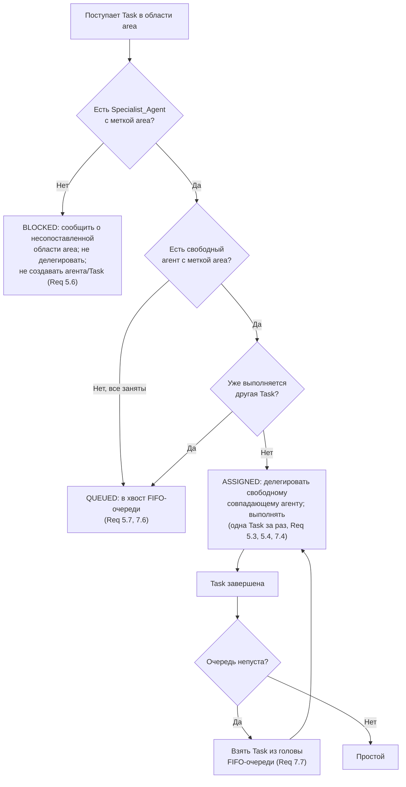

# Flow Orchestrator: Профильные агенты, маршрутизация и FIFO-очередь

> Как Orchestrator подбирает профильного `Specialist_Agent` по метке
> специализации, маршрутизирует к нему `Task` и выполняет задачи строго по одной
> за раз через FIFO-очередь.
>
> _Validates: Requirements 5.1, 5.2, 5.3, 5.4, 5.6, 5.7, 7.4, 7.5, 7.6, 7.7_

---

## Назначение

Этот файл правил режима **Flow Orchestrator** описывает две связанные
дисциплины:

1. **Маршрутизация по специализации** — какому `Specialist_Agent` Orchestrator
   делегирует `Task` в конкретной технической области (Requirement 5).
2. **Выполнение по одной задаче за раз** — как Orchestrator держит в работе не
   более одной `Task` и упорядочивает остальные в FIFO-очереди (Requirement 7).

Базовый принцип Flow Orchestrator сохраняется: **Orchestrator только делегирует**.
Он не создаёт агентов, файлы, директории и сами `Task` — он лишь подбирает
исполнителя, ставит задачи в очередь или сообщает о блокировке.

> Замечание об именах: значения вида `<New_Project_Name>` / `<new-slug>` —
> заполнители, разрешаемые при установке шаблона в конкретный проект. В этом
> наборе правил проект называется **Flow Orchestrator**, slug — `flow-orchestrator`.

---

## Глоссарий (краткий)

- **Orchestrator** — режим-координатор; единственная задача — делегирование.
- **Specialist_Agent** — профильный агент-исполнитель с ровно одной
  специализацией, обозначенной уникальной меткой технической области.
- **Специализация (метка технической области)** — ярлык области, например
  `JavaScript`, `Rust`, `TypeScript`, `Python`.
- **Task** — обычная (регулярная) задача; имеет техническую область, по которой
  выбирается исполнитель.
- **Техническая область Task** — метка области, в которой должна быть выполнена
  `Task`; сопоставляется с метками специализации агентов.
- **FIFO-очередь** — очередь «первым поступил — первым на выполнение» для `Task`,
  ожидающих исполнения.

---

## 1. Профильные агенты-специалисты (Requirement 5.1, 5.2)

### Правила

1. **Ровно одна специализация на агента (Req 5.1).** Flow Orchestrator SHALL
   определять набор из как минимум одного `Specialist_Agent`, где каждый
   `Specialist_Agent` имеет **ровно одну** специализацию, обозначенную **уникальной
   меткой технической области** (например, `JavaScript`, `Rust`). У агента не может
   быть нуля или более одной метки — строго одна.
2. **Несколько агентов с одной меткой допустимы (Req 5.2).** WHERE несколько
   `Specialist_Agent` имеют **одну и ту же** специализацию, Flow Orchestrator SHALL
   разрешать наличие нескольких агентов с одинаковой меткой. То есть метка
   специализации **не обязана** быть уникальной между агентами — она лишь
   единственная **внутри** одного агента.

### Пример пула агентов

| Агент | Специализация (ровно одна метка) |
|-------|----------------------------------|
| `js-1`   | `JavaScript` |
| `js-2`   | `JavaScript` |  ← несколько агентов с одинаковой меткой (Req 5.2) |
| `rust-1` | `Rust` |
| `py-1`   | `Python` |

Здесь у каждого агента ровно одна метка (Req 5.1), а метка `JavaScript` разделяется
агентами `js-1` и `js-2` (Req 5.2).

> Структурная страховка: режим Orchestrator (`.<new-slug>modes-entry.yaml`)
> ограничен инструментами делегирования (без `edit`/`command`), поэтому
> Orchestrator не может создать агента или `Task` сам — он только маршрутизирует.

---

## 2. Маршрутизация Task по метке специализации (Requirement 5.3, 5.4, 5.6, 5.7)

Когда нужно сформировать или исполнить `Task` в технической области `area`,
Orchestrator выбирает исполнителя **исключительно по совпадению метки**.

### Алгоритм маршрутизации

```
Дано: area (техническая область Task), пул Specialist_Agent, факт занятости исполнителя.

1. Найти всех агентов, у кого specialization == area  → matching.
2. ЕСЛИ matching пуст:
       → BLOCKED: сообщить о несопоставленной области area;
         НЕ делегировать; НЕ создавать агента или Task самому. (Req 5.6)
3. ИНАЧЕ ЕСЛИ есть свободный агент в matching И исполнитель не занят:
       → ASSIGNED: делегировать любому свободному агенту из matching. (Req 5.3, 5.4)
4. ИНАЧЕ (все matching заняты, либо исполнитель уже занят другой Task):
       → QUEUED: поставить Task в хвост FIFO-очереди до освобождения
         совпадающего агента. (Req 5.7, 7.6)
```

### Правила

1. **Совпадение метки — обязательное условие (Req 5.3).** WHEN требуется
   сформировать `Task` в определённой технической области, Orchestrator SHALL
   делегировать формирование этой `Task` тому `Specialist_Agent`, **метка
   специализации которого совпадает** с технической областью `Task`. Делегирование
   агенту с несовпадающей меткой запрещено.
2. **Выбор среди нескольких совпадающих — любой свободный (Req 5.4).** WHERE
   несколько `Specialist_Agent` имеют метку, совпадающую с областью `Task`,
   Orchestrator SHALL делегировать `Task` **любому из них, кто в данный момент
   свободен** (не выполняет другую `Task`). Конкретный выбор среди свободных
   совпадающих агентов не регламентирован — допустим любой из них.
3. **Нет совпадающей метки → блокировка (Req 5.6).** IF **ни один**
   `Specialist_Agent` не имеет метки, совпадающей с технической областью `Task`,
   THEN Orchestrator SHALL:
   - **не делегировать** эту `Task`;
   - **сообщить о блокирующей ситуации** с явным указанием **несопоставленной
     технической области**;
   - **не создавать** `Specialist_Agent` или `Task` самостоятельно.
4. **Все совпадающие заняты → очередь (Req 5.7).** WHILE все `Specialist_Agent` с
   совпадающей меткой выполняют другую `Task`, IF поступает `Task` для
   делегирования, THEN Orchestrator SHALL **поставить эту `Task` в очередь** до
   освобождения хотя бы одного совпадающего агента (см. раздел 3, FIFO).

### Сообщение о блокировке (Req 5.6)

При отсутствии совпадающей метки Orchestrator сообщает (по смыслу):

> **«Блокировка: нет `Specialist_Agent` с меткой специализации, совпадающей с
> технической областью `<area>`. Task не делегирована. Агент и Task не созданы.»**

Ключевое: в сообщении обязательно называется **несопоставленная техническая
область** `<area>`, и Orchestrator **не** порождает артефакты сам.

---

## 3. Выполнение по одной задаче за раз и FIFO-очередь (Requirement 7.4–7.7)

Orchestrator держит в работе **не более одной** `Task` одновременно. Остальные
`Task` ждут в FIFO-очереди («первым поступил — первым на выполнение»).

### Правила

1. **Не более одной Task в работе (Req 7.4).** Orchestrator SHALL обеспечивать
   одновременное выполнение **не более одной** `Task`. В любой момент времени
   «текущая» `Task` — либо одна, либо отсутствует.
2. **Не начинать вторую, пока идёт первая (Req 7.5).** WHILE одна `Task`
   выполняется, Orchestrator SHALL **не начинать** выполнение другой `Task`.
3. **Дополнительная Task → в хвост FIFO (Req 7.6).** WHILE одна `Task` выполняется,
   IF поступает дополнительная `Task` к выполнению, THEN Orchestrator SHALL
   поместить дополнительную `Task` **в хвост FIFO-очереди** до завершения текущей
   `Task`.
4. **Завершение → голова очереди (Req 7.7).** WHEN текущая `Task` завершается и
   очередь непуста, Orchestrator SHALL начать выполнение `Task`, находящейся **в
   голове FIFO-очереди** (первой поступившей среди ожидающих).

### Дисциплина FIFO

- Задачи становятся «текущими» **строго в том порядке**, в каком они поступили в
  очередь: никакая позже поступившая `Task` не обгоняет ранее поступившую.
- В очередь `Task` добавляется только в **хвост** (Req 7.6); на исполнение берётся
  только из **головы** (Req 7.7).
- Пока текущая `Task` не завершена, голова очереди не извлекается (Req 7.5).

### Взаимодействие маршрутизации и очереди

Маршрутизация (раздел 2) и дисциплина «одна за раз» (раздел 3) действуют вместе:

- `Task` попадает в очередь, если **исполнитель занят** текущей `Task` (Req 7.6)
  **или** все совпадающие по метке агенты заняты (Req 5.7).
- `Task` блокируется (не попадает в очередь), если **нет ни одного** агента с
  совпадающей меткой (Req 5.6) — её сначала нужно разблокировать (появлением
  агента с нужной меткой), и только потом она может быть делегирована.

---

## 4. Объединённый поток решения



---

## 5. Чек-лист (быстрая справка)

**Маршрутизация (Requirement 5):**

- ✅ У каждого `Specialist_Agent` ровно одна метка специализации (Req 5.1).
- ✅ Несколько агентов могут иметь одинаковую метку (Req 5.2).
- ✅ `Task` делегируется агенту с **совпадающей** меткой области (Req 5.3).
- ✅ При нескольких совпадающих — любому **свободному** из них (Req 5.4).
- ✅ Нет совпадающей метки → **блокировка** с указанием области; агент/Task не
  создаются самим Orchestrator (Req 5.6).
- ✅ Все совпадающие заняты → `Task` **в очередь** до освобождения (Req 5.7).

**Очередь и выполнение (Requirement 7):**

- ✅ В работе не более одной `Task` одновременно (Req 7.4).
- ✅ Пока идёт одна `Task`, другая не начинается (Req 7.5).
- ✅ Дополнительная `Task` идёт в **хвост** FIFO-очереди (Req 7.6).
- ✅ По завершении текущей берётся `Task` из **головы** очереди (Req 7.7).

**Orchestrator никогда:**

- ❌ Не делегирует `Task` агенту с несовпадающей меткой (Req 5.3).
- ❌ Не создаёт `Specialist_Agent` или `Task` самостоятельно при блокировке
  (Req 5.6).
- ❌ Не запускает вторую `Task`, пока выполняется текущая (Req 7.5).
- ❌ Не нарушает порядок FIFO: позже поступившая `Task` не обгоняет более раннюю
  (Req 7.6, 7.7).

---

_Этот артефакт — часть набора правил режима Flow Orchestrator
(`rules-flow-orchestrator/`): 00-core-identity, 01-planning-and-master-list,
02-specialists-and-routing, 03-task-protocol, 04-document-order. Состав `Task`,
протокол Task_TODO из трёх пунктов и подготовка Report описаны в
`03-task-protocol.md`._
