# Flow Orchestrator: Протокол Task и Task_TODO

> Правило режима **Flow Orchestrator**. Описывает состав обычной Task
> (необходимая и обновляемая Documentation, назначение Specialist_Agent) и
> протокол чек-листа Task_TODO из трёх пунктов, по итогам которого готовится
> Report для Orchestrator.
>
> _Validates: Requirements 7.1, 7.2, 7.3, 8.1, 8.2, 8.3, 8.4, 8.5, 8.6, 8.7, 8.12, 8.13_

---

## Глоссарий (краткий)

- **Orchestrator** — режим-координатор Flow Orchestrator; только делегирует, сам
  не создаёт файлы, задачи и директории.
- **Specialist_Agent** — профильный агент-исполнитель с ровно одной специализацией
  (меткой технической области, например JavaScript, Rust).
- **Task** — обычная (регулярная) задача, сформированная Specialist_Agent на основе
  Master_Task_List.
- **Task_TODO** — чек-лист с галочками внутри Task; отмечается исполняющим агентом
  по ходу работы.
- **Documentation** — документы проекта (например, файлы в `docs/`, README, правила
  проекта), которые Task должна прочитать и/или обновить.
- **Report** — отчёт об изменениях, который Specialist_Agent готовит для
  Orchestrator после выполнения Task.

---

## 1. Состав обычной Task (Requirement 7)

Каждая обычная Task в Flow Orchestrator формируется по фиксированному составу.
Без перечисленных ниже атрибутов Task считается неполной и не должна выполняться.

### 1.1 Назначенный Specialist_Agent в начале Task (Req 8.11)

- **Первая строка Task SHALL называть назначенного Specialist_Agent**, ответственного
  за её выполнение. Назначение указывается в самом начале Task, чтобы исполнитель и
  область ответственности были однозначны с первой строки.

```
Назначен: <Specialist_Agent с меткой специализации, совпадающей с областью Task>
```

### 1.2 Необходимая Documentation (Req 7.1)

- **Task SHALL указывать не менее одной идентифицируемой ссылки на Documentation**,
  необходимую для выполнения этой Task.
- «Идентифицируемая ссылка» — это путь или однозначный идентификатор документа
  (например, `docs/ARCHITECTURE.md`, `README.md`, конкретный раздел правил), а не
  расплывчатое упоминание.
- Список необходимой Documentation не может быть пустым, `null` или состоять только
  из пробельных символов.

### 1.3 Обновляемая Documentation (Req 7.2)

- **Task SHALL указывать не менее одной идентифицируемой ссылки на Documentation**,
  которую необходимо обновить по итогам выполнения Task.
- Это отдельный обязательный атрибут: даже если набор обновляемых документов
  совпадает с необходимыми, он указывается явно. Список не может быть пустым,
  `null` или состоять только из пробельных символов.

### 1.4 Назначение частей работы при нескольких агентах (Req 7.3)

- **ЕСЛИ над одной Task должны работать несколько Specialist_Agent**, ТО **Task SHALL
  назначать каждую часть работы ровно одному Specialist_Agent** так, чтобы **ни одна
  часть работы не оставалась без назначенного Specialist_Agent**.
- Каждая часть работы имеет ровно одного ответственного агента: не ноль и не
  несколько. Деление на части не должно оставлять «ничейных» участков.

```
Части работы (когда задействовано несколько агентов):
- Часть A: <описание> → ответственный: <Specialist_Agent #1>
- Часть B: <описание> → ответственный: <Specialist_Agent #2>
(каждая часть — ровно один агент; непокрытых частей нет)
```

### 1.5 Старт работы без подтверждения назначения (Req 8.12)

- **Specialist_Agent SHALL начинать работу над назначенной Task без подтверждения или
  отметки назначения со стороны Orchestrator.** Получив назначение, агент сразу
  приступает к протоколу Task_TODO (раздел 2) и не ждёт от Orchestrator
  дополнительного «подтверждаю»/«принято».

---

## 2. Протокол Task_TODO (Requirement 8)

Каждая Task содержит Task_TODO — чек-лист с галочками, отражающий прогресс. Он
делает ход работы прозрачным и гарантирует, что Documentation поддерживается в
актуальном состоянии.

### 2.1 Ровно три пункта в фиксированном порядке (Req 8.1)

**Task_TODO SHALL содержать ровно три отмечаемых пункта в фиксированном порядке:**

```
- [ ] 1. Прочитать Documentation
- [ ] 2. Выполнить задачу
- [ ] 3. Обновить Documentation
```

Порядок не меняется и пункты не добавляются/не удаляются: всегда ровно эти три, в
последовательности (1) → (2) → (3).

### 2.2 Инициализация — все «не отмечено» (Req 8.2)

- **Когда Task создаётся, все три пункта Task_TODO SHALL быть в состоянии
  «не отмечено»** (`[ ]`). Ни один пункт не может быть предварительно отмечен в
  момент создания Task.

### 2.3 Порядок отметки пунктов (Req 8.3, 8.4, 8.5, 8.6)

- **Пункт 1 «Прочитать Documentation» SHALL отмечаться после того, как
  Specialist_Agent прочитал Documentation** (Req 8.3).
- **Пункт 2 «Выполнить задачу» SHALL отмечаться после того, как Specialist_Agent
  выполнил задачу** (Req 8.4).
- **Пункт 3 «Обновить Documentation» SHALL отмечаться после того, как
  Specialist_Agent обновил Documentation** (Req 8.6).
- **Строгий порядок (Req 8.5):** любой пункт Task_TODO **SHALL отмечаться только
  после того, как отмечены все предшествующие ему пункты** в порядке
  `(1) Прочитать Documentation → (2) Выполнить задачу → (3) Обновить Documentation`.

Из строгого порядка следует инвариант: «Обновить Documentation» ⇒ «Выполнить
задачу» ⇒ «Прочитать Documentation». Нельзя отметить пункт 2, пока не отмечен
пункт 1; нельзя отметить пункт 3, пока не отмечены пункты 1 и 2.

```mermaid
flowchart LR
    R["[ ] 1. Прочитать Documentation"] -->|после чтения| RC["[x] 1. Прочитать Documentation"]
    RC --> D["[ ] 2. Выполнить задачу"]
    D -->|после выполнения| DC["[x] 2. Выполнить задачу"]
    DC --> U["[ ] 3. Обновить Documentation"]
    U -->|после обновления| UC["[x] 3. Обновить Documentation"]
    UC --> REP["Подготовить Report (не пункт TODO)"]
```



### 2.4 Нет пункта TODO для подготовки Report (Req 8.8)

- **Task_TODO SHALL NOT содержать отмечаемого пункта для подготовки Report.**
  Подготовка Report не является четвёртым пунктом чек-листа. Пунктов всегда ровно
  три (раздел 2.1); Report готовится как следствие отметки пункта 3, но сам по себе
  галочки в Task_TODO не имеет.

---

## 3. Report для Orchestrator (Requirement 8.7, 8.13)

- **Когда пункт «Обновить Documentation» отмечен, Specialist_Agent SHALL подготовить
  Report для Orchestrator** (Req 8.7). Report готовится сразу после третьей галочки
  и не является отдельным отмечаемым пунктом Task_TODO (см. раздел 2.4).
- **Report SHALL содержать перечень всех внесённых в рамках Task изменений** (Req
  8.13): изменённые/созданные файлы, обновлённые документы и иные результаты работы
  по этой Task.

```
Report для Orchestrator
- Task: <идентификатор/описание задачи>
- Назначенный агент: <Specialist_Agent>
- Внесённые изменения:
  - <изменение 1: файл/документ и суть правки>
  - <изменение 2: ...>
  - ... (полный перечень всех изменений в рамках Task)
```

---

## 4. Чек-лист соблюдения протокола (быстрая справка)

**Состав Task (Req 7):**

- ✅ Первая строка Task называет назначенного Specialist_Agent (Req 8.11).
- ✅ Указана ≥ 1 идентифицируемая ссылка на необходимую Documentation (Req 7.1).
- ✅ Указана ≥ 1 идентифицируемая ссылка на обновляемую Documentation (Req 7.2).
- ✅ При нескольких агентах каждая часть работы назначена ровно одному агенту, без
  «ничейных» частей (Req 7.3).

**Старт и протокол Task_TODO (Req 8):**

- ✅ Агент начинает работу без подтверждения назначения Orchestrator (Req 8.12).
- ✅ Task_TODO содержит ровно три пункта в порядке: прочитать → выполнить →
  обновить Documentation (Req 8.1).
- ✅ При создании Task все три пункта не отмечены (Req 8.2).
- ✅ Пункт отмечается только после соответствующего действия и только после
  отметки всех предшествующих пунктов (Req 8.3, 8.4, 8.5, 8.6).

**Report (Req 8.7, 8.13):**

- ✅ После отметки «Обновить Documentation» готовится Report для Orchestrator
  (Req 8.7).
- ✅ Report перечисляет все внесённые в рамках Task изменения (Req 8.13).
- ❌ В Task_TODO нет отдельного отмечаемого пункта для подготовки Report (Req 8.8).

---

_Этот артефакт — часть набора правил режима Flow Orchestrator
(`rules-flow-orchestrator/`): 00-core-identity, 01-planning-and-master-list,
02-specialists-and-routing, 03-task-protocol, 04-document-order._
