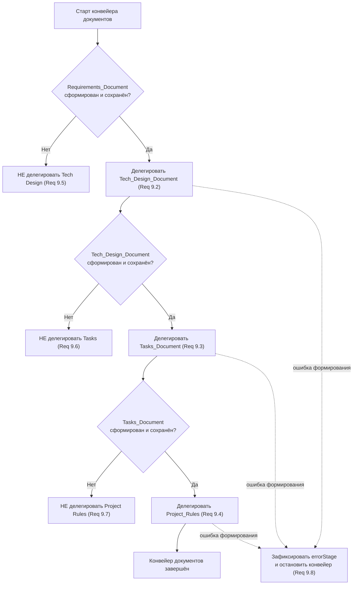

# Flow Orchestrator: Порядок документов форка

> Фиксированный порядок формирования документов и guard-правила делегирования
> для режима-координатора Flow Orchestrator.
>
> _Validates: Requirements 9.1, 9.2, 9.3, 9.4, 9.5, 9.6, 9.7, 9.8_

---

## Назначение

Этот файл правил задаёт **дисциплину порядка документов** для Flow Orchestrator.
Документы форка формируются строго в одной фиксированной последовательности; ни
один документ нельзя пропустить или сформировать раньше своего предшественника.

Flow Orchestrator **только делегирует** формирование документов профильным
агентам-исполнителям (`Specialist_Agent`). Он не создаёт и не редактирует сами
документы. Здесь описано, **когда** Flow Orchestrator вправе делегировать
следующий документ, а когда обязан остановиться.

> Замечание о именах: значения вида `<new-slug>` — заполнители, разрешаемые при
> установке шаблона в конкретный проект.

---

## Глоссарий (краткий)

- **Flow Orchestrator** — режим/агент-координатор; единственная задача —
  делегирование.
- **Specialist_Agent** — профильный агент-исполнитель, который формирует и
  сохраняет документ по поручению Flow Orchestrator.
- **«Сформирован»** — документ создан **и** сохранён. Документ, который создан,
  но не сохранён, НЕ считается сформированным.
- **Requirements_Document** — документ требований форка.
- **Tech_Design_Document** — документ технического дизайна форка.
- **Tasks_Document** — документ задач форка.
- **Project_Rules** — документ правил проекта форка.

---

## 1. Фиксированный порядок (Requirement 9.1)

Документы форка SHALL формироваться строго в следующей последовательности — без
пропусков и без изменения порядка:

```
Requirements_Document → Tech_Design_Document → Tasks_Document → Project_Rules
```

- Требования предшествуют дизайну.
- Дизайн предшествует задачам.
- Правила проекта оформляются последними.

Flow Orchestrator НИКОГДА не меняет этот порядок и НИКОГДА не пропускает этап.

---

## 2. Правила перехода (когда делегировать следующий документ)

Каждый переход выполняется **только** после того, как предыдущий документ
сформирован (создан и сохранён).

1. **Requirements → Tech Design (Req 9.2).** КОГДА формирование
   Requirements_Document завершено и документ сохранён, Flow Orchestrator SHALL
   делегировать формирование Tech_Design_Document.
2. **Tech Design → Tasks (Req 9.3).** КОГДА формирование Tech_Design_Document
   завершено и документ сохранён, Flow Orchestrator SHALL делегировать
   формирование Tasks_Document.
3. **Tasks → Project Rules (Req 9.4).** КОГДА формирование Tasks_Document
   завершено и документ сохранён, Flow Orchestrator SHALL делегировать
   формирование Project_Rules.

После делегирования каждого документа Flow Orchestrator ожидает подтверждение, что
документ сформирован и сохранён, и только затем переходит к следующему этапу.

---

## 3. Guard-правила (когда НЕ делегировать)

Эти запреты гарантируют, что ни один документ не будет сформирован раньше своего
предшественника.

- **Нет Requirements → нет Tech Design (Req 9.5).** ЕСЛИ Requirements_Document не
  сформирован (не создан или не сохранён), ТО Flow Orchestrator SHALL NOT
  делегировать формирование Tech_Design_Document.
- **Нет Tech Design → нет Tasks (Req 9.6).** ЕСЛИ Tech_Design_Document не
  сформирован (не создан или не сохранён), ТО Flow Orchestrator SHALL NOT
  делегировать формирование Tasks_Document.
- **Нет Tasks → нет Project Rules (Req 9.7).** ЕСЛИ Tasks_Document не сформирован
  (не создан или не сохранён), ТО Flow Orchestrator SHALL NOT делегировать
  формирование Project_Rules.

Обобщённое правило: делегирование документа допустимо тогда и только тогда, когда
**все** предшествующие ему документы в последовательности раздела 1 уже
сформированы и сохранены, и в конвейере не зафиксирована ошибка (раздел 4).

---

## 4. Обработка ошибок (Requirement 9.8)

ЕСЛИ формирование любого из документов завершилось ошибкой, ТО Flow Orchestrator:

1. SHALL **прекратить** делегирование всех последующих документов; и
2. SHALL **зафиксировать признак ошибки**, указывающий на этап (документ), на
   котором формирование не было завершено.

Признак ошибки блокирует весь дальнейший конвейер: пока ошибка не снята,
делегирование любого следующего документа недопустимо. Это предотвращает
формирование задач без завершённого дизайна или правил проекта без завершённых
задач.

Пример признака ошибки (по смыслу): `errorStage = "Tech_Design_Document"` —
формирование Tech_Design_Document не было завершено; делегирование
Tasks_Document и Project_Rules остановлено.

---

## 5. Таблица решений делегирования

| Состояние сформированных документов | Можно делегировать |
|-------------------------------------|--------------------|
| Ничего не сформировано, ошибок нет | Requirements_Document |
| Requirements сформирован | Tech_Design_Document |
| Requirements + Tech Design сформированы | Tasks_Document |
| Requirements + Tech Design + Tasks сформированы | Project_Rules |
| Зафиксирована ошибка на любом этапе | — (делегирование остановлено, Req 9.8) |

---

## 6. Поток порядка документов



---

## 7. Чек-лист (быстрая справка)

**Flow Orchestrator всегда:**

- ✅ Делегирует документы строго в порядке
  Requirements → Tech Design → Tasks → Project Rules (Req 9.1).
- ✅ Делегирует следующий документ только после того, как предыдущий сформирован
  и сохранён (Req 9.2, 9.3, 9.4).
- ✅ Фиксирует признак ошибки с указанием этапа, если формирование не завершено
  (Req 9.8).

**Flow Orchestrator никогда:**

- ❌ Не меняет порядок и не пропускает документы (Req 9.1).
- ❌ Не делегирует Tech_Design_Document без сформированного Requirements_Document
  (Req 9.5).
- ❌ Не делегирует Tasks_Document без сформированного Tech_Design_Document
  (Req 9.6).
- ❌ Не делегирует Project_Rules без сформированного Tasks_Document (Req 9.7).
- ❌ Не продолжает делегирование после ошибки формирования (Req 9.8).

---

_Этот файл — часть набора правил режима Flow Orchestrator
(`rules-<new-slug>/`): 00-core-identity, 01-planning-and-master-list,
02-specialists-and-routing, 03-task-protocol, 04-document-order. Структурная
реализация guard-правил порядка документов — в
`src/orchestration/document-pipeline.ts` (`DOC_ORDER`, `canDelegate`,
`recordError`)._
